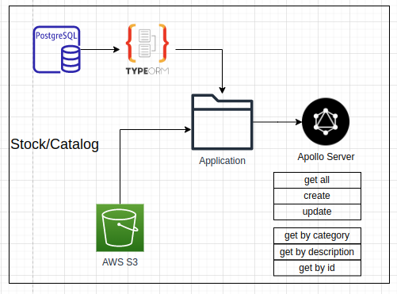

# apollo-graphql-v4




## Available queries in this project:

### Products queries

#### products

#### _Query_

---
```graphql
query ExampleQuery {
  products {
    name
    description
    price
    picture {
      source
    }
    categories {
      name
    }
    color
  }
}
```

#### productsByDescription

#### _Query_

---

```graphql
query ExampleQuery($productDescription: String) {
  productsByDescription(productDescription: $productDescription) {
    name
    description
    price
    picture {
      source
    }
    categories {
      name
    }
    color
  }
}
```

#### _Variables_

---

```graphql
{
  "productDescription": "Confy",
}
```

#### productsByCategory
#### _Query_
---
``` graphql
query ExampleQuery($categoryName: String) {
  productsByCategory(categoryName: $categoryName) {
    name
    description
    price
    picture {
      source
    }
    categories {
      name
    }
    color
  }
}
```
#### _Variables_
---
```graphql
{
  "categoryName": "Clothing" 
}
```
#### productById
#### _Query_
---
```graphql
query ExampleQuery($productId: String) {
  productById(productId: $productId) {
    id
    name
    description
    price
    picture {
      source
    }
    categories {
      name
    }
    color
  }
}
```
#### _Variables_
---
```graphql
{
  "productId": "P003"
}
```
### Categories queries

#### categories

#### _Query_

---
```graphql
query ExampleQuery {
  categories {
    name
    products {
      name
    }
  }
}
```

### Pictures queries

#### pictures

#### _Query_

---
```graphql
query ExampleQuery {
  pictures {
    source
    product {
      name
    }
  }
}
```
